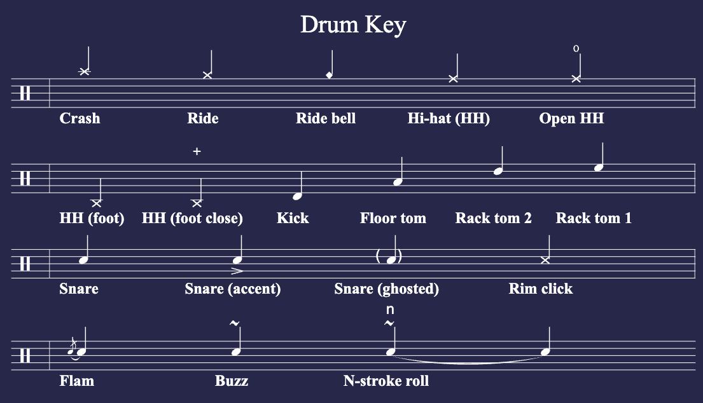

# README

Personal music transcription and creation repository.
Uses ABC notation with `abcjs`  through `abcjs vscode` extension to render sheet music.

## ABC Notation
[abc notation examples](https://abcnotation.com/examples)
[abc notation annotations](https://abcnotation.com/wiki/abc:standard:v2.1#annotations)
[abc notation tutorial](http://www.lesession.co.uk/abc/abc_notation.htm)
[abcjs](https://paulrosen.github.io/abcjs/overview/abc-notation.html)

ABC notation is used to mark melodic music typically but `abcjs` adds conveniences for drumming that we'll be using.

### Basic Primer
ABC header consists of a few fields:
- T: Title field. Ex: T:Music sheet
- L: Notes of different lengths. Ex: L:1/2
- K: Key signature. Ex: K:C clef=perc
- M: Time signature. Ex: M:4/4
- Q: Tempo field. Ex: Q:120
- X: Index field. Ex: X:1

- The X: field is primarily for computers' benefit, as they (computers) have much more trouble than human beings in telling where one tune stops and the next starts. Many software packages therefore rely on the X: field to signify the start of a tune, even if there's only one tune in a file, and a blank line, followed by an X: field, delimits one tune from the next. It is therefore good practise to include an X: field at the head of your abc tune(s).
- Barlines are denoted by the pipe symbol |.
- Common time is shown as C, and cut time as C| (the letter C followed by the pipe symbol).
- The L: note length field, the M: meter field, the K: key signature field and the Q: tempo field can all be inserted in the middle of a tune to indicate a key change.

### Drum Key
| Drum | Note (in the key of `C`) |
|------|-------|
| Crash | A' |
| Ride | `!style=x![g]`|
| Ride bell | `!style=harmonic![g]`|
| Hi-Hat (Closed) | `!style=x![e]` |
| Hi-Hat (Open) | `!open!!style=x![e]` |
| Hi-Hat (Foot) | `!style=x![B,]` |
| Hi-Hat (Foot close from open) | `!+!!style=x![B,]` |
| Kick | D |
| Floor Tom | A |
| Rack Tom 1 | e |
| Rack Tom 2 | d |
| Snare | c |
| Snare (Accent) | `!>!c` |
| Snare (ghosted) | `"<(" ">)"c` |
| Rim Click | `!style=x!c` |
| Rest | z |



#### From ABCJS
##### Alternate note heads:
In both the K: and the V: element, you can include the parameter:
```
style=rhythm
style=harmonic
style=x
style=normal
style=triangle
```
You can also use the above as a decoration to a single note to affect just that note:
```
!style=rhythm!
```
This changes the note heads to a different shape.

Here's a sample:
```
X:1
T:alternate heads
M:C
L:1/8
U:n=!style=normal!
K:C treble style=rhythm
"Am" BBBB B2 B>B | "Dm" B2 B/B/B "C" B4 |"Am" B2 nGnB B2 nGnA | "Dm" nDB/B/ nDB/B/ "C" nCB/B/ nCB/B/ |B8| B0 B0 B0 B0 |]
%%text This translates to:
[M:C][K:style=normal]
[A,EAce][A,EAce][A,EAce][A,EAce] [A,EAce]2 [A,EAce]>[A,EAce] |[DAdf]2 [DAdf]/[DAdf]/[DAdf] [CEGce]4 |[A,EAce]2 GA [A,EAce] GA |D[DAdf]/[DAdf]/ D[DAdf]/[DAdf]/ C [CEGce]/[CEGce]/ C[CEGce]/[CEGce]/ |[CEGce]8 | [CEGce]2 [CEGce]2 [CEGce]2 [CEGce]2 |]
GAB2 !style=harmonic![gb]4|GAB2 [K: style=harmonic]gbgb|
[K: style=x]
C/A,/ C/C/E C/zz2|
w:Rock-y did-nt like that
```